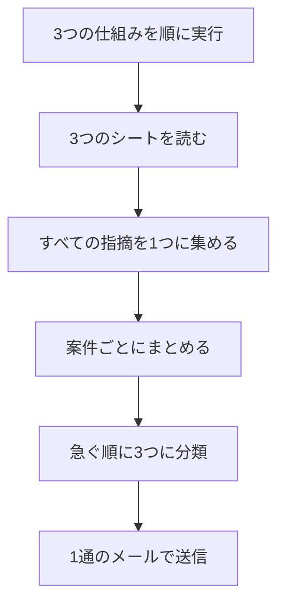

# 09. 通知の統合

毎朝バラバラに届いていた3つの通知を、1通にまとめる仕組みです。

新しい機能を作るのではなく、積み上がったものを整理する回です。

---

## 背景

[01. 対応待ち一覧](01-todo-list.md)、[03. 不足書類チェック](03-document-check.md)、
[06. 請求対象の抽出](06-billing.md) は、それぞれ独立して動きます。

1つずつ作っている間は問題になりませんが、
3つそろうと毎朝3通のメールが届くことになります。

さらに、同じ案件が別々のメールに出てくるため、
何をすればよいかを自分で整理する必要がありました。

---

## 処理の流れ

AIは使っていません。

---

## 設計で決めたこと

### 仕組みごとに章を分けない

3通の内容をつなげるだけでは、章が「対応待ち」「書類」「請求」のままになります。

これは作る側の区切りであって、受け取る側の区切りではありません。
朝に知りたいのは「今日まず何をするか」です。

| 章 | 入るもの |
|---|---|
| 今日やること | 工事予定日が今日・明日／30日以上経過した請求漏れ・放置案件／請求が至急 |
| 今週中に | 着手漏れ／要請求／書類の不足／フォルダがない |
| 手がすいたら | 見積放置／書類の重複／完了日の未入力 |

各項目には「請求がまだ」「書類が足りない」のような札を付けて、
どの観点からの指摘かが分かるようにしています。

### 同じ案件は1つにまとめる

3つの仕組みは、同じ案件を別の角度から見ています。
そのため、統合すると同じ案件番号が複数の章に出てきます。

案件番号でまとめ、理由を下に並べる形にしました。
どの章に載せるかは、その案件が持つ**いちばん急ぐ理由**で決まります。

### 重い処理は毎朝の流れに入れない

[05. 発注書の金額照合](05-order-match.md) は含めていません。
PDFを1件ずつ変換するため、9件で2〜3分かかります。

毎朝動かすものと、必要なときに動かすものを分けています。

### 既存のシートは作り直さない

01の対応待ち一覧は、担当者ごと・区分ごとに見出しを付けた、人が読むための形式です。
機械が読みやすい表ではありません。

作り直すこともできましたが、見出しを手がかりに読み取る方式にしました。
01の判定ルールをもう一度書くと、二重管理になるためです。

---

## 必要なもの

次の3つのシートが存在することを前提にします。

- `対応待ち一覧`（01の出力）
- `不足書類チェック`（03の出力）
- `請求対象`（06の出力）

いずれかがなくても動作しますが、その分の指摘は含まれません。

---

## 設定方法

1. [src/09_digest.gs](../src/09_digest.gs) を貼り付けて保存
2. `sendMorningDigest` を実行し、メールの内容を確認
3. トリガーの実行関数を `dailyDigest` に設定

`dailyDigest` は、3つの仕組みを順に実行してから、まとめたメールを送信します。

既存のトリガーが `dailyTask`（01のみ）になっている場合は、
`dailyDigest` に変更してください。

---

## 出力

HTMLメールで送信します。

- 件名に、至急と要対応の件数を表示
- 本文は、急ぐ順に3つの章
- 各案件に、理由を色付きで列挙
- 末尾に未請求の合計額

---

## 検証結果

架空の案件データで検証しました。
