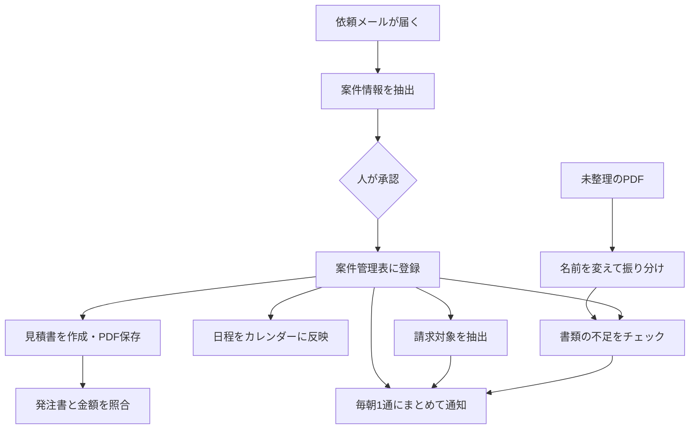

# 設備工事会社向け バックオフィス自動化システム

メールで届いた依頼を、案件登録から見積・発注照合・請求・日程調整まで、
一本の流れで扱うための9つの仕組みです。

Google Apps Script（GAS）とOpenAI APIで作り、
スプレッドシート・Gmail・Googleドライブ・Googleカレンダー上で動きます。

> この仕組みは、設備工事会社のバックオフィス業務を想定して作った練習用のものです。
> 検証はすべて、自分で作成した架空のデータで行っています。
> 実在の企業・取引のデータは使用していません。

---

## 全体の流れ

人が判断する場所を、流れの中に必ず残しています。
AIが読み取った内容は、承認を押すまで本番のデータに反映されません。

---

## 9つの仕組み

| # | 仕組み | できること | AI |
|---|---|---|---|
| 1 | [対応待ち一覧](docs/01-todo-list.md) | 着手漏れ・請求漏れ・放置案件を毎朝抽出 | 不使用 |
| 2 | [メールから案件登録](docs/02-mail-extract.md) | 依頼メールを読み、承認後に案件表へ登録 | 使用 |
| 3 | [不足書類チェック](docs/03-document-check.md) | 案件フォルダに必要な書類が揃っているか照合 | 不使用 |
| 4 | [見積書の作成](docs/04-quote.md) | 依頼内容から見積書を作り、PDFで保存 | 使用 |
| 5 | [発注書の金額照合](docs/05-order-match.md) | 発注書と見積書の金額差を検出 | 使用 |
| 6 | [請求対象の抽出](docs/06-billing.md) | 完了したのに請求していない案件を抽出 | 不使用 |
| 7 | [ファイルの振り分け](docs/07-file-sort.md) | 未整理のPDFを中身から判定し、名前を統一 | 使用 |
| 8 | [日程調整](docs/08-schedule.md) | 返信メールから日程を読み、カレンダーへ反映 | 使用 |
| 9 | [通知の統合](docs/09-digest.md) | 3つの通知を、急ぐ順に1通にまとめる | 不使用 |

---

## 設計の方針

9つを通して、次の3つを守っています。

### 計算と判断は、AIにやらせない

AIが担当するのは「書かれていることを読み取る」ところまでです。

金額の計算はスプレッドシートの数式が行い、
日時の計算（「午前」を9:00〜12:00に変換するなど）はGASが行います。
同じ入力でもAIの答えが毎回同じとは限らないため、
数字が合わないと困る部分は、AIの外に出しています。

### 判定できないものは、動かさない

案件番号が読み取れない、作業の種類を特定できない、候補が複数ある。
こうした場合、推測で埋めずに人へ回します。

書類の振り分けでは、判定できなかったファイルは移動せず、
理由を記録して未整理のまま残します。
推測で動かすと、書類が行方不明になるためです。

### 人が承認してから、本番に反映する

AIが読み取った結果は、いったん確認用のシートに出します。
人が内容を見て承認したものだけが、案件管理表やカレンダーに反映されます。

返信メールの下書きも作成しますが、送信はしません。

---

## 使っている技術

- Google Apps Script
- OpenAI API（gpt-4.1-mini）
- Google スプレッドシート / Gmail / ドライブ / カレンダー
- Drive API v2（PDFのテキスト変換）

APIキーはコードに書かず、スクリプトプロパティに保管しています。

---

## ソースコード

[src/](src/) に各仕組みのコードを置いています。
設定方法と判定ルールは、上の表のリンクから各ドキュメントを参照してください。

---

## 作者について

横浜で清掃業を営む個人事業主です。IT未経験から独学でAIツールを使えるようになりました。
プログラムは書けないため、コードはAIに書いてもらい、
仕組みの設計と検証を自分で行っています。

作る過程と、つまずいた点は [Dify実践ブログ](https://ai-shoshinsha-49.com/) に記録しています。

## ライセンス

MIT License
