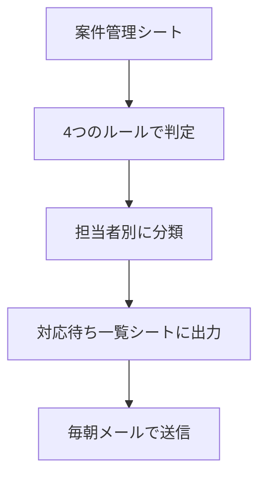

# 01. 対応待ち一覧

案件管理表から「対応が必要な案件」だけを抽出し、担当者別に毎朝メールで届ける仕組みです。

案件が増えるほど、手が止まっている案件を人の目で見つけるのは難しくなります。
これを4つのルールで自動的に拾い出します。

---

## 処理の流れ

AIは使っていません。判定に必要なのは、日付の計算とステータスの比較だけのためです。

---

## 抽出のルール

| 区分 | 条件 |
|---|---|
| 着手漏れ | 工事予定日まで3日以内なのに、ステータスが「受注済」のまま |
| 放置案件 | 完了・請求済以外で、最終更新から14日以上動きがない |
| 請求漏れ | ステータスが「完了」のまま |
| 見積放置 | ステータスが「見積中」のまま10日以上経過 |

このルールの中身を決めることが、この仕組みでもっとも時間のかかる部分でした。
技術的な難しさよりも、「何を対応待ちとみなすか」の線引きが問題になります。

---

## 必要なもの

### シート

`案件管理` シートに、次の列があることを前提にしています。

| 列 | 内容 |
|---|---|
| A | 案件番号 |
| B | 顧客名 |
| C | 工事内容 |
| D | 受注日 |
| E | 工事予定日 |
| F | ステータス |
| G | 担当者 |
| H | 最終更新日 |
| I | 金額 |

出力先の `対応待ち一覧` シートは、実行時に自動で作成されます。

### 権限

初回実行時に、スプレッドシートとGmailへのアクセス承認が必要です。

---

## 設定方法

1. スプレッドシートから「拡張機能」→「Apps Script」を開く
2. [src/01_todoList.gs](../src/01_todoList.gs) の内容を貼り付けて保存
3. `createTodoList` を実行し、一覧が作られることを確認
4. `sendTodoMail` を実行し、メールが届くことを確認

### 毎朝の自動実行

トリガーを設定します。

1. エディタ左の時計アイコン（トリガー）を開く
2. 「トリガーを追加」
3. 実行する関数：`dailyTask`
4. イベントのソース：時間主導型
5. 時間ベースのタイマー：日タイマー
6. 時刻：午前7時〜8時

`dailyTask` は、一覧の作成とメール送信をまとめて実行します。

---

## 出力

### シート

担当者ごとに区分を分けて表示し、緊急度に応じて色分けします。

| 色 | 意味 |
|---|---|
| 赤 | 本日・明日が工事予定日／30日以上経過 |
| オレンジ | 14日以上経過 |
| 黄色 | それ以外 |

### メール

シートの内容をHTMLメールとして送信します。
送信先は、既定ではスクリプトの所有者です。
他の担当者に送る場合は `sendTodoMail` 内の送信先を変更します。

---

## 検証結果

架空の案件管理表15件で検証しました。

- 15件のうち、対応が必要な7件を抽出
- 工事完了から50日経過しても請求していない案件を検出
- 担当者別に分けたところ、一人の担当者に請求漏れが3件集中していることを確認

会社名・人名・金額はすべて架空のものです。

---

## 制限事項

- ステータスの更新に依存します。人がステータスを更新し忘れた案件は、正しく判定できません。
  （この弱点は [06. 請求対象の抽出](06-billing.md) で補っています）
- 工事予定日・最終更新日が日付として入力されている必要があります。
  文字列が混ざっていると日数計算ができません。
- 1つのスプレッドシート内で完結する仕組みです。複数ファイルにまたがる案件管理には対応していません。
