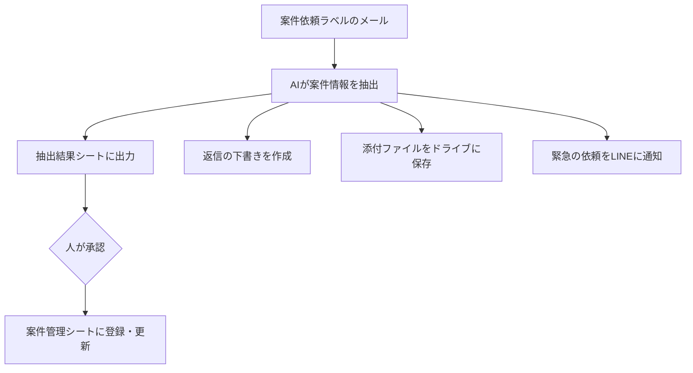

# 02. メールから案件登録

Gmailに届いた依頼メールをAIが読み取り、人が承認したものだけを案件管理表に登録する仕組みです。

メールの文面は人によって書き方が異なるため、決まったルールだけでは読み取れません。
ここで初めてAIを使っています。

---

## 処理の流れ

AIが読み取った内容は、いったん「抽出結果（確認待ち）」シートに出します。
人が承認するまで、案件管理表には反映されません。

---

## 抽出する項目

顧客名、連絡者、電話番号、作業場所、工事内容、希望日、緊急度、見積希望の有無、関連案件番号。

メールを3つに分類します。

| 判定 | 内容 |
|---|---|
| 新規依頼 | 新しい作業の依頼 |
| 既存案件の変更 | 日程変更など、既存案件への連絡 |
| 案件以外 | 支払い連絡など、案件ではないもの |

---

## AIへの指示で決めたルール

テストを繰り返して追加したものです。

- メールに書かれていないことは推測で埋めない
- 情報がない項目は、空欄にせず「不明」と書く
- 希望日は日付を1つだけ。決まらなければ「不明」にして、候補は要確認事項に回す
- 日程変更の場合は、変更後の日付を希望日に、変更前の日付を要確認事項に書く
- 見積もりに触れていなければ「不明」。推測で「なし」にしない

「不明」と空欄を混在させないことが重要です。
確認する人が「空欄は処理漏れか」と迷うためです。

---

## 必要なもの

### Gmailのラベル

| ラベル | 用途 |
|---|---|
| 案件依頼 | 読み取り対象のメールに付ける |
| 処理済み | 処理が終わったメールに自動で付く（二重登録の防止） |

実運用では、Gmailのフィルタで差出人や件名のキーワードから自動でラベルを付けられます。
依頼専用のアドレスを用意する方法もあります。

### APIキー

OpenAI APIのキーが必要です。
コードには書かず、スクリプトプロパティに `OPENAI_API_KEY` として保管します。

1. エディタ左下の歯車（プロジェクトの設定）を開く
2. 「スクリプト プロパティ」→「スクリプト プロパティを追加」
3. プロパティ名に `OPENAI_API_KEY`、値にキーを入力

### 権限

Gmail、スプレッドシート、Googleドライブへのアクセス承認が必要です。
LINE通知を使う場合は、LINE Messaging APIのトークンも設定します。

---

## 設定方法

1. [src/02_mailExtract.gs](../src/02_mailExtract.gs) を貼り付けて保存
2. スクリプトプロパティにAPIキーを設定
3. Gmailに「案件依頼」ラベルを作成
4. `extractFromMails` を実行

### 自動実行

5〜10分ごとのトリガーを設定します。
緊急の依頼をLINEで通知するため、間隔を短くしています。

---

## 承認後の動作

抽出結果シートの「確認状況」を「承認」に変更すると、その場で案件管理表に反映されます。

| メールの種類 | 動作 |
|---|---|
| 新規依頼 | 案件番号を自動採番して追加 |
| 既存案件の変更 | 案件番号で該当行を探し、工事予定日を更新 |

---

## 同時に行うこと

### 返信の下書き作成

抽出と同時に、お客様への返信文案を作成します（API呼び出しは1回で済みます）。
Gmailの下書きとして保存するだけで、送信はしません。

指示したルールは次の4つです。

- 宛名（顧客名＋様）から始める
- 不足情報があれば丁寧に質問する
- 金額や日程を確定させる表現は使わない
- 緊急なら「確認のうえ至急ご連絡します」

### 添付ファイルの保存

メールごとにフォルダを作り、Googleドライブに保存します。
シートにはリンクを記録します。

### 緊急依頼のLINE通知

緊急度が「高」と判定された依頼だけ、LINEに通知します。
顧客名・場所・内容・希望・電話番号が1画面で分かる形式です。

LINE Messaging APIをGASから直接呼んでいます。中継サービスは使っていません。
LINEを設定していない場合は、代わりにメールで通知します。

---

## 検証結果

AIが間違えやすい点を仕込んだ、架空のメール8通で検証しました。

| # | 内容 | 結果 |
|---|---|---|
| ① | 整った依頼（箇条書き） | 全項目を抽出 |
| ② | あいまいな日付「来週の水曜か木曜あたり」 | 候補を要確認事項へ |
| ③ | 情報がほとんどない依頼 | 推測で埋めず「不明」 |
| ④ | 1通に2物件の依頼 | 2行に分割 |
| ⑤ | 既存案件の日程変更 | 変更と判定、関連案件番号も抽出 |
| ⑥ | 支払い完了の連絡 | 「案件以外」と判定 |
| ⑦ | 至急の水漏れ | 緊急度「高」、LINEに通知 |
| ⑧ | 署名・引用が長いメール | 署名欄の住所を作業場所と誤認しなかった |

8通から9行を登録（④が2行に分かれたため）。

会社名・人名・住所はすべて架空のものです。

---

## 検証で分かったこと

**同じメールでも、実行するたびに結果が変わることがあります。**

1回目と2回目を比較したところ、指示を変えていない部分でも違いが出ました。

- 顧客名「高橋不動産株式会社」→「高橋不動産」
- 緊急度「中」→「低」
- 見積希望「不明」→「なし」（メールに記載がないにもかかわらず）

いずれも大きな誤りではありませんが、毎回同じ答えが返るとは限りません。
抽出結果を直接案件管理表に書き込まず、確認用シートを挟む設計にした理由がここにあります。

---

## 制限事項

- AIの出力は完全に一定ではありません。人の確認を前提とした設計です。
- 実際の顧客メールを外部のAIに送信する場合は、取引先の了承や社内規程の確認が必要です。
- 1回の実行で処理するメール数に上限を設けています（既定20件）。
- 本文が長いメールは、先頭から一定の文字数のみをAIに渡します。
