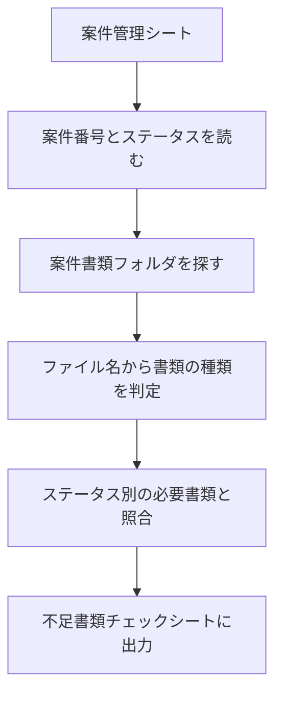

# 03. 不足書類チェック

案件フォルダに必要な書類が揃っているかを照合し、不足している書類を一覧で知らせる仕組みです。

ステータスごとに必要な書類が異なるため、
「完了した案件に報告書がない」「請求済なのに請求書がない」といった抜けを検出します。

---

## 処理の流れ

AIは使っていません。ファイル名に特定の語が含まれるかを見るだけで判定できるためです。

---

## ステータス別の必要書類

| ステータス | 必要な書類 |
|---|---|
| 見積中 | 依頼書 |
| 受注済 | 依頼書、見積書、発注書 |
| 施工中 | 依頼書、見積書、発注書 |
| 完了 | 依頼書、見積書、発注書、報告書 |
| 請求済 | 依頼書、見積書、発注書、報告書、請求書 |

全案件に同じ書類を求めると、見積中の案件に「報告書がない」と表示されてしまいます。
この表は業種や運用によって変わるため、実際には担当者と決める部分です。

---

## 書類の種類の判定

ファイル名に次の語が含まれていれば、その書類とみなします。

| 書類 | 判定に使う語 |
|---|---|
| 依頼書 | 依頼 |
| 見積書 | 見積 |
| 発注書 | 発注 |
| 報告書 | 報告 |
| 請求書 | 請求 |

命名規則を厳密に決めなくても、語が1つ含まれていれば拾えます。
たとえば `佐藤様_御見積.pdf` は「見積」を含むため、見積書と判定されます。

どの語も含まないファイルは「分類不能」として別枠に出します。
この枠がないと、名前が揃っていないファイルがすべて「書類なし」扱いになり、誤検出が増えます。

---

## 判定結果

| 判定 | 意味 |
|---|---|
| OK | 必要な書類が揃っている |
| 不足あり | 必要な書類が足りない |
| 要確認 | 同じ種類の書類が2つ以上ある、または分類不能なファイルがある |
| フォルダなし | 案件フォルダがドライブに存在しない |

同じ種類が複数ある場合、どちらが最新かは判定しません。
旧版か重複かは人が確認する部分です。

---

## 必要なもの

### ドライブのフォルダ構成
