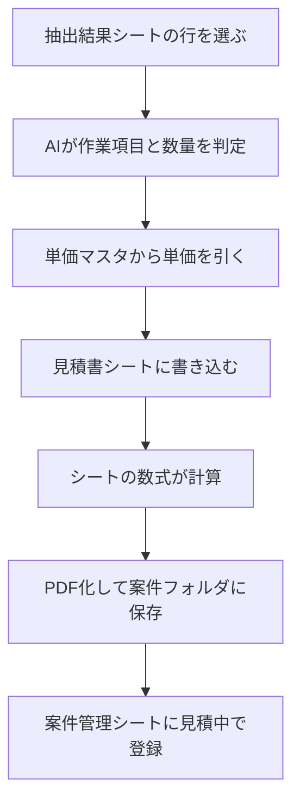

# 04. 見積書の作成

メールの依頼内容から見積書を作り、PDFにして案件フォルダへ保存する仕組みです。

金額を扱うため、計算をAIにやらせない設計にしています。

---

## 処理の流れ

[02. メールから案件登録](02-mail-extract.md) の抽出結果を入力として使います。

---

## 役割分担

| 担当 | 内容 |
|---|---|
| AI | 依頼内容が単価マスタのどの作業にあたるか、数量はいくつかを判定する |
| GAS | 単価マスタから単価を引く、シートに書き込む、PDFにする |
| シートの数式 | 数量×単価、小計、消費税、合計の計算 |
| 人 | 単価の最終決定、値引きの判断、承認 |

AIが扱うのは「何を・いくつ」の読み取りまでです。
金額の計算には一切関与しません。

値引きは、見積書を作成するたびに必ず0で書き込みます。
AIにもGASにも値引き額を決めさせない設計です。

---

## AIへの指示で決めたルール

- 作業項目は、単価マスタの名称をそのまま使う。名称だけを書き、単位や括弧書きを付けない
- 一覧にまったく該当しない場合は「一覧にない作業：〇〇」と返す
- 候補はあるが決められない場合は「判断できない：〇〇が不明（候補：A、B）」と返す
- 数量が書かれていなければ、1と決めつけず「不明」にする
- 金額・単価・値引きは判定しない

「一覧にない」と「判断できない」を書き分けさせているのは、人の対応が変わるためです。
前者は単価マスタへの項目追加か外注の検討、後者は顧客への確認で済みます。

---

## 必要なもの

### シート

**単価マスタ**

| 列 | 内容 |
|---|---|
| A | 作業項目 |
| B | 単位 |
| C | 標準単価 |
| D | 備考 |

**見積書**

宛先・件名・案件番号・発行日・見積番号・有効期限、明細8行、小計・値引き・消費税率・消費税額・合計、備考。

金額の計算式は、テンプレート側にセルの数式として入れてあります。
GASが書き込むのは、作業項目・数量・単位・単価の4つだけです。

### APIキー

OpenAI APIのキーをスクリプトプロパティに `OPENAI_API_KEY` として保管します。

---

## 設定方法

1. 単価マスタと見積書のシートを用意する
2. 見積書シートの自社情報欄（社名・住所・電話・メール・担当者）を自分の情報に書き換える
3. [src/04_quote.gs](../src/04_quote.gs) を貼り付けて保存
4. `ROOT_FOLDER_ID` に案件書類フォルダのIDを設定
5. 抽出結果シートの「確認状況」のプルダウンに「見積作成」を追加
6. 行を選んで `createQuoteForSelectedRow` を実行

---

## 案件番号の採番

新規案件の場合、見積書の作成時に案件番号を自動で採番します。

採番時には次の3か所を確認し、最大値の次の番号を使います。

- 案件管理シート
- 抽出結果シート
- ドライブの案件フォルダ名

作成後は、抽出結果の行に案件番号を書き戻し、案件管理シートにも「見積中」で登録します。

ここで登録された案件は、10日間動きがなければ
[01. 対応待ち一覧](01-todo-list.md) の「見積放置」に表示されます。

---

## PDFの出力

見積書シートをPDF化して、案件番号のフォルダに `2026-018_見積書.pdf` の形で保存します。
フォルダがなければ作成します。

同じ名前のファイルがある場合は、古いものをゴミ箱に移動します。

出力時には次の処理を行います。

- 出力範囲を限定し、作り手向けの注記を含めない
- 入力欄の背景色と文字色を、PDF化の間だけ白地・黒文字に退避する
- 顧客名に会社らしい語が含まれていれば「御中」、なければ「様」を付ける

---

## 検証結果

判断に迷う点を仕込んだ、架空の見積依頼メール5通で検証しました。

| # | 内容 | 結果 |
|---|---|---|
| ① | エアコン洗浄を3台 | 見積書を作成 |
| ② | 「エアコンのことで」4室分 | 判断できない（候補：エアコン洗浄、エアコン交換） |
| ③a | 換気扇交換2台 | 見積書を作成 |
| ③b | 1階の配管点検 | 一覧にない作業 |
| ④ | 屋上防水工事 | 一覧にない作業 |
| ⑤ | 給湯器1台「できるだけ安く」 | 見積書を作成。値引きは0のまま |

②が重要な検証項目です。
単価マスタには「エアコン洗浄（12,000円）」と「エアコン交換（95,000円）」の両方があり、
決め打ちされると金額が約8倍変わります。

⑤では「できるだけ安く」という要望があっても、値引きを決めませんでした。

会社名・人名・金額はすべて架空のものです。

---

## 検証で分かったこと

**AIの判定は6件すべて妥当でした。問題が出たのは仕組みの側です。**

初期の版では、3件連続で見積書を作成したところ、
すべてに同じ案件番号が振られ、先に作成した2件のPDFが上書きされて消えました。

エラーは一切出ません。見積書は毎回正常に作成されます。
前のファイルが静かに消えるだけです。

原因は、採番時に案件管理シートだけを見ていたことでした。
作成直後の案件はまだ登録されていないため、何度採番しても同じ番号になります。

現在は3か所を確認する形に修正しています。

もう1点、AIが作業項目名に単位を付けて返すことがありました
（「エアコン洗浄」→「エアコン洗浄（単位：台）」）。
指示を修正したうえで、GAS側でも部分一致で照合できるようにしています。
指示の修正だけに頼らず、ずれても動く受け皿を用意する必要がありました。

---

## 制限事項

- 単価マスタにない作業は見積書を作成できません。人が項目を追加するか、個別に対応します。
- 明細は8行までです。それを超える項目は書き込まれません。
- 単価は標準単価をそのまま使います。現場条件による調整は人が行います。
- AIの出力は完全に一定ではありません。作成後の確認を前提としています。
