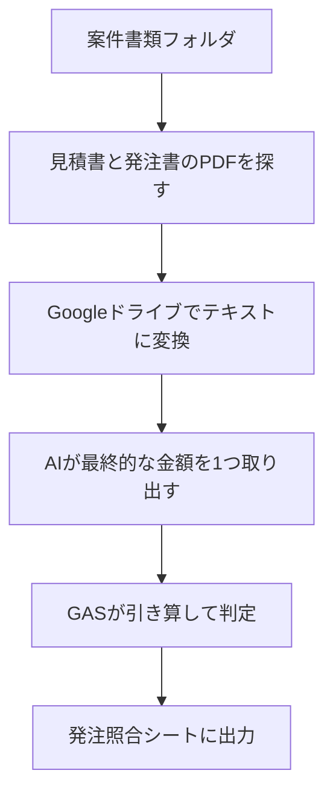

# 05. 発注書の金額照合

案件フォルダにある見積書と発注書の金額を照合し、差額を検出する仕組みです。

発注書の金額が見積書と違っていても、気づかないまま工事が進むことがあります。
これを自動で突き合わせます。

---

## 処理の流れ



AIが行うのは、テキストから金額を1つ取り出すところまでです。
引き算と判定はGASが行います。

---

## 判定結果

| 判定 | 意味 |
|---|---|
| 一致 | 発注金額＝見積金額 |
| 金額違い | 差額あり。どちらがいくら多いかを表示 |
| 発注書なし | 見積書はあるが発注書が届いていない |
| 見積書なし | 発注書だけ届いている |
| 読み取り失敗 | PDFから金額を特定できなかった |

差額が出た場合も、その原因は判定しません。
値引き交渉の結果か、単純な誤記か、人が確認する部分です。

---

## AIへの指示で決めたルール

- 合計・発注金額・御見積金額のように、最後に出てくる総額を選ぶ
- 小計や消費税額、明細1行ごとの金額は選ばない
- 数字だけを半角で返す。カンマ・円・¥は付けない
- 金額が見つからない、または判断できない場合は null を返す
- 計算はしない。書かれている数字をそのまま返す

---

## 必要なもの

### Drive API

GAS自体にPDFを読む機能がないため、
PDFをいったんGoogleドキュメントに変換してテキストを取り出します。

1. エディタ左側の「サービス」を開く
2. 「Drive API」を選ぶ
3. バージョンを「v2」にして追加

### ファイル名の規則

ファイル名に「見積」または「発注」が含まれていることを前提にしています。
[07. ファイルの振り分け](07-file-sort.md) で名前を統一しておくと確実です。

### APIキー

OpenAI APIのキーをスクリプトプロパティに保管します。

---

## 設定方法

1. Drive API（v2）を有効にする
2. [src/05_orderMatch.gs](../src/05_orderMatch.gs) を貼り付けて保存
3. `ROOT_FOLDER_ID` に案件書類フォルダのIDを設定
4. `checkOrderAmounts` を実行

動作確認用に `debugPdfText` を用意しています。
各PDFから何文字取り出せたかをログに出力します。

---

## 検証結果

架空の発注書を案件フォルダに配置して検証しました。

| 案件 | 見積金額 | 発注金額 | 判定 |
|---|---|---|---|
| 2026-018 | 198,000 | 198,000 | 一致 |
| 2026-019 | 39,600 | 36,000 | 金額違い（差 -3,600） |
| 2026-020 | なし | 61,600 | 見積書なし |
| 2026-011、017 | あり | なし | 発注書なし |
| 2026-004他3件 | — | 金額の記載なし | 読み取り失敗 |

9件すべて正しく判定されました。

2026-019は「税抜金額にて発注」と備考に書かれた発注書で、
差額がちょうど消費税分の3,600円と出ています。

金額の記載がない書類4件では、AIは金額を返しませんでした。
案件番号「2026-006」や日付「2026/09/25」といった数字はありますが、
これらを金額として拾うことはありませんでした。

会社名・人名・金額はすべて架空のものです。

---

## 検証で分かったこと

### OCRの指定は、連続処理に向きません

PDFをテキストに変換する際、初期の版では `ocr: true`（画像から文字を読む処理）を
指定していました。

結果、ほとんどの変換が失敗しました。

```
User rate limit exceeded for OCR
```

利用回数の制限です。通る件数は毎回変わり、3秒待っても10秒待っても
7件中1件しか処理できませんでした。時間を空けるだけでは解決しません。

`ocr: true` の指定をやめたところ、7件すべてが一度で通りました。

7件で制限に達するということは、案件数の多い環境では実用になりません。

### スキャンしたPDFも読み取れます

当初は「スキャンした発注書は文字が取れない」と想定していました。
検証のため画像だけのPDFを用意しましたが、実際には読み取れ、金額も正確でした。

`ocr: true` を指定しなくても、画像のみのPDFには自動でOCRが適用されるようです。
回数制限の対象になるのは、明示的に指定した場合のみと考えられます。

ただし、取り出せた文字の並びは崩れます。

文字入りPDF：

```
作業項目 数量 単位 単価 金額 給湯器交換 1 台 180,000 180,000
小計 180,000 円
消費税 18,000 円
発注金額 198,000 円
```

スキャンPDF：

```
作業項目
数量
台
1
円
180,000
...
合計
180,000
小計
'180,000円'
```

この崩れた文字列から正しい金額を取り出せたのは、AIに読ませていたためです。
「合計の次にある数字」を探す作りでは拾えませんでした。

[03. 不足書類チェック](03-document-check.md) ではファイル名だけで判定できたためAIは不要でしたが、
今回はAIでなければ読み取れませんでした。
AIを使うかどうかは、扱うデータの形によって変わります。

---

## 制限事項

- PDFの変換に時間がかかります。9件で2〜3分程度です。
  毎朝の自動実行には向かないため、必要なときに手動で実行する想定です。
- ファイル名に「見積」「発注」が含まれている必要があります。
- 1つのフォルダに同じ種類の書類が複数ある場合、どれを使うかは保証されません。
- 差額の原因は判定しません。確認は人が行います。
