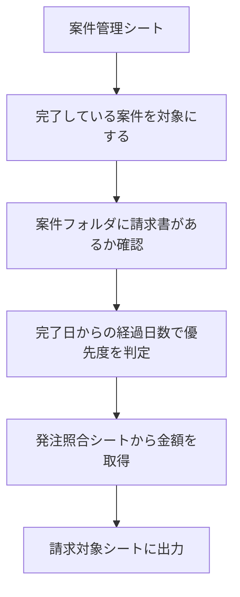

# 06. 請求対象の抽出

工事が完了しているのに、まだ請求していない案件を抽出する仕組みです。

[01. 対応待ち一覧](01-todo-list.md) にも「請求漏れ」の項目がありますが、
そちらはステータスだけを見ているため、更新漏れがあると検出できません。
ここでは請求書PDFの有無で判定します。

---

## 処理の流れ

---

## 判定のルール

| 判定 | 条件 |
|---|---|
| 至急 | 完了から30日以上、請求書なし |
| 要請求 | 完了から7日以上、請求書なし |
| 様子見 | 完了から7日未満、請求書なし |
| 請求済 | 請求書PDFがある |
| 完了日が未入力 | ステータスは完了・請求済だが、完了日が空欄 |

日数の区切りは、運用に合わせて設定で変更できます。

工事が完了していない案件（完了日もなく、ステータスも完了以外）は一覧に出しません。
請求の対象ではないためです。

---

## 設計で決めたこと

### 完了日は人が入力する

工事が実際に終わった日をどこから取るかには、いくつか方法があります。

- 案件管理シートに「完了日」の列を追加する（人が入力）
- 工事予定日を完了日とみなす
- 報告書PDFの作成日時を完了日とみなす

請求は金額が絡むため、推測で日付を決めない方針としました。

ただし入力漏れがあると判定できないため、
完了日が空の案件は「完了日が未入力」として別枠に出します。

### 金額は再計算しない

請求予定額は、[05. 発注書の金額照合](05-order-match.md) の結果を再利用します。
PDFを読み直すと時間がかかるためです。

発注金額があればそちらを優先します。正式な契約額のためです。

この方式により、9件の処理が4秒で完了します。
05を直接実行する場合は2〜3分かかります。

---

## 必要なもの

### シート

`案件管理` シートに **「完了日」の列** を追加します。
見出し名で列を探すため、位置はどこでも構いません。

`発注照合` シート（05の出力）があれば、金額を自動で取得します。
なければ金額欄は空欄になります。

### フォルダ

案件書類フォルダに、案件番号のフォルダがあることを前提にします。
ファイル名に「請求」が含まれていれば請求書と判定します。

---

## 設定方法

1. 案件管理シートに「完了日」の列を追加する
2. [src/06_billing.gs](../src/06_billing.gs) を貼り付けて保存
3. `ROOT_FOLDER_ID` に案件書類フォルダのIDを設定
4. `extractBillingTargets` を実行

---

## 出力

優先度順に並べ、色分けして表示します。

| 色 | 判定 |
|---|---|
| 赤 | 至急 |
| オレンジ | 要請求 |
| 黄色 | 完了日が未入力 |
| 緑 | 請求済 |

シートの末尾に、請求済を除いた **未請求の合計額** を表示します。

---

## 検証結果

架空の案件で検証しました。

| 案件 | 完了日 | ステータス | 請求書 | 判定 |
|---|---|---|---|---|
| 2026-018 | 61日前 | 見積中 | なし | 至急（198,000円） |
| 2026-019 | 11日前 | 見積中 | なし | 要請求（36,000円） |
| 2026-020 | 4日前 | 完了 | なし | 様子見（61,600円） |
| 2026-004 | 41日前 | 請求済 | あり | 請求済 |
| 2026-006他2件 | 空欄 | 完了・請求済 | なし | 完了日が未入力 |

未請求の合計：295,600円

会社名・人名・金額はすべて架空のものです。

---

## 検証で分かったこと

### ステータスが更新されていなくても検出できます

2026-018と2026-019は、見積書を作成した時点の「見積中」のまま更新されていませんでした。
ステータスだけで判定する方式では、この2件は検出できません。

完了日と請求書の有無で判定したため、正しく抽出できています。

人の入力に依存する部分を減らすほど、見逃しが減ります。

### 仕込んでいない矛盾が見つかりました

検証で想定していなかったのが、2026-010と2026-012です。
どちらもステータスは「請求済」なのに、フォルダに請求書PDFがありません。

実務であれば確認が必要な状態です。
請求書を紙で発行してPDFを保存し忘れたのか、ステータスの付け間違いか。

ステータスと書類のどちらか片方だけを見ていては、気づけません。

---

## 制限事項

- 完了日の入力が必要です。入力漏れの案件は優先度を判定できません。
- 請求書の判定はファイル名に依存します。「請求」の語が含まれている必要があります。
- 金額は05の結果に依存します。05を実行していない場合、金額欄は空欄になります。
- 請求済かどうかはPDFの有無で判断します。実際の入金状況は確認していません。
