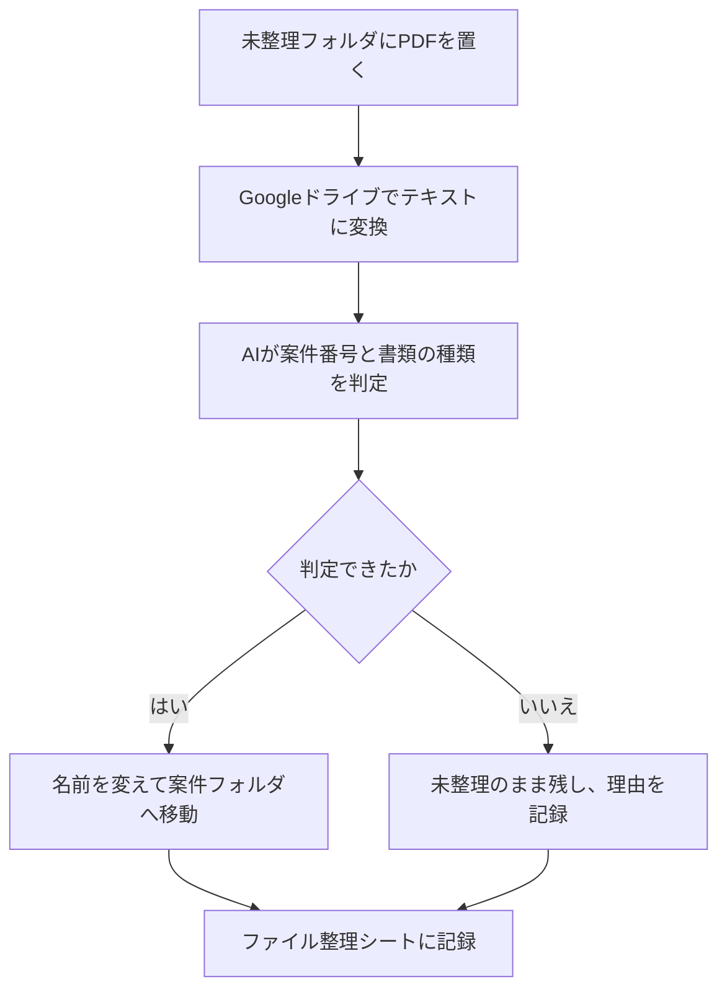

# 07. ファイルの振り分け

未整理のPDFの中身を読み、正しい名前に変えて案件フォルダへ移動する仕組みです。

[03. 不足書類チェック](03-document-check.md) では、
ファイル名に判定用の語が含まれていないファイルを扱えませんでした。
ここでは名前を揃える側を作っています。

---

## 処理の流れ



---

## 設計で決めたこと

### 判定できないものは動かさない

案件番号が読み取れない、書類の種類が分からない、該当する案件フォルダがない。
こうした場合は未整理フォルダに残し、理由をシートに記録します。

推測で移動すると、書類が行方不明になります。

### 上書きはしない

移動先に同じ名前のファイルがある場合、移動を中止します。

旧版か重複かは判断できないため、人が確認する部分です。
[04. 見積書の作成](04-quote.md) で、案件番号の重複により
PDFを上書きして消した経験を踏まえています。

---

## AIへの指示で決めたルール

- 案件番号は「2026-018」の形。この形の番号がなければ null
- 日付や電話番号を案件番号として返さない
- 書類の種類は、依頼書・見積書・発注書・報告書・請求書から1つ選ぶ
- どれにも当てはまらない、判断できない場合は null
- 推測で埋めない。null にした場合は理由を書く

GAS側でも、返ってきた値を検証しています。
一覧にない書類の種類や、案件番号の形式に合わない値は採用しません。

---

## 判定結果

| 判定 | 動作 |
|---|---|
| 振り分け済 | 名前を変えて案件フォルダへ移動 |
| 案件番号が不明 | 未整理のまま |
| 書類の種類が不明 | 未整理のまま |
| 案件が見つからない | 未整理のまま（案件管理シートに該当なし） |
| フォルダがない | 未整理のまま |
| 重複の可能性 | 未整理のまま（同名ファイルが存在） |
| 読み取り失敗 | 未整理のまま |

---

## 必要なもの

### フォルダ

マイドライブに「未整理」フォルダを作ります。
案件書類フォルダとは別の場所に置きます。

### Drive API

PDFのテキスト変換に使います。[05](05-order-match.md) と同じ設定です。
サービスから「Drive API」をバージョンv2で追加してください。

### APIキー

OpenAI APIのキーをスクリプトプロパティに保管します。

---

## 設定方法

1. マイドライブに「未整理」フォルダを作る
2. [src/07_fileSort.gs](../src/07_fileSort.gs) を貼り付けて保存
3. `INBOX_FOLDER_ID` に未整理フォルダのIDを設定
4. `ROOT_FOLDER_ID` に案件書類フォルダのIDを設定
5. `sortUnsortedFiles` を実行

動作確認用に `debugInbox` を用意しています。
各ファイルから何文字取り出せたかをログに出力します。

---

## 出力

ファイル整理シートに、1ファイルにつき1行を記録します。

| 列 | 内容 |
|---|---|
| 元のファイル名 | 変更前の名前 |
| 判定 | 上記の判定結果 |
| 案件番号 | AIが読み取った案件番号 |
| 書類の種類 | AIが判定した種類 |
| 新しいファイル名 | 変更後の名前 |
| 備考 | 判定できなかった理由など |
| 場所 | 移動先、または未整理フォルダ |

元のファイル名を記録に残すため、後から追跡できます。

---

## 検証結果

判定に困る名前のPDF6件で検証しました。

| 元のファイル名 | 結果 |
|---|---|
| スキャン20260915.pdf | 2026-011/2026-011_見積書.pdf へ移動 |
| IMG_4821.pdf | 2026-011/2026-011_発注書.pdf へ移動 |
| 見積_山田様_最終版.pdf | 2026-013/2026-013_見積書.pdf へ移動 |
| 20260925_報告.pdf | 2026-018/2026-018_報告書.pdf へ移動 |
| 請求書.pdf | 案件番号が不明（未整理のまま） |
| 2026-018_見積書.pdf | 重複の可能性（未整理のまま） |

振り分け4件、未整理のまま2件。

`請求書.pdf` に対するAIの返答は次のとおりです。

```json
{"caseNo":null,"docType":"請求書",
 "reason":"案件番号の形式に合う番号が書類内に記載されていないため"}
```

この書類には日付「2026/09/25」と電話番号「045-000-0000」が記載されていますが、
いずれも案件番号として採用していません。
書類の種類は「請求書」と判定しつつ、案件番号だけを null にしています。

会社名・人名・金額はすべて架空のものです。

---

## 03との連携

振り分けの実行後、[03. 不足書類チェック](03-document-check.md) を再実行すると、
2026-011の判定が変わります。

| | 振り分け前 | 振り分け後 |
|---|---|---|
| 不足 | 依頼書、発注書 | 依頼書 |
| 分類不能 | 2件 | 0件 |

03で「ファイル名から判定できない」とされていた2件が、
正しい名前に変わったことで認識されるようになりました。

検出する仕組みと、整える仕組み。両方がそろって機能します。

---

## 制限事項

- **この仕組みは実際にファイルを移動し、名前も変更します。**
  最初は控えのあるファイルで試してください。
- PDF以外のファイルは処理しません。
- 書類の中身に案件番号が記載されている必要があります。
- 案件管理シートに存在しない案件番号の書類は移動しません。
- PDFの変換に時間がかかります。件数が多い場合は分割して実行してください。
