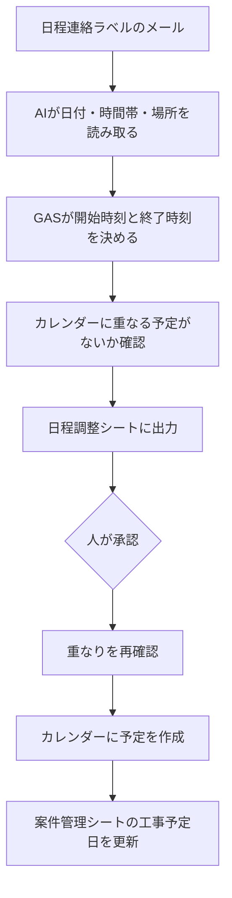

# 08. 日程調整

お客様からの返信メールに書かれた日程を読み取り、
承認後にGoogleカレンダーへ予定を作成する仕組みです。

日程の書き方は人によって異なるため、AIで読み取ります。
ただし時刻の計算はAIにやらせません。

---

## 処理の流れ

---

## 役割分担

| 担当 | 内容 |
|---|---|
| AI | メールに書かれた日付・時間帯・場所を読み取る |
| GAS | 相対的な日付の計算、所要時間の決定、重なりの確認、予定の作成 |
| 人 | 候補が複数あるときの選択、最終承認 |

AIが返すのは「2026-10-03 の午前」までです。
これを9:00〜12:00に変換するのはGASが行います。

[04. 見積書の作成](04-quote.md) で「金額の計算はAIにやらせない」と決めた方針を、
日時にも適用しています。

---

## 所要時間のルール

| 時間帯の指定 | 設定される時刻 |
|---|---|
| 午前 | 9:00〜12:00 |
| 午後 | 13:00〜17:00 |
| 時刻の指定あり | その時刻から2時間 |
| 終日 | 9:00〜17:00 |

作業内容ごとの所要時間を使う方法もありますが、
単価マスタに手を入れると見積書の仕組みに影響するため、今回は固定のルールにしています。

---

## 判定結果

| 判定 | 意味 |
|---|---|
| 確認待ち | 日時が1つに決まり、重なりもない |
| 候補が複数 | 「3日か4日」のように候補が2つ以上。人が選ぶ |
| 予定が重なる | 既にカレンダーに予定がある |
| 時間帯が不明 | 日付は分かったが、時間帯が書かれていない |
| 日時を特定できず | 日付そのものが決まらない |

---

## 重なりの確認は2回

メールを読み取ったときと、承認を押したときの2回確認します。

抽出から承認までに時間が空くため、その間に別の予定が入る可能性があります。
承認の時点で重なっていれば、予定は作成しません。

既存の予定名と時間を表示するため、何とぶつかったかが分かります。

---

## 必要なもの

### Gmailのラベル

| ラベル | 用途 |
|---|---|
| 日程連絡 | 読み取り対象のメールに付ける |
| 日程処理済み | 処理後に自動で付く |

[02. メールから案件登録](02-mail-extract.md) の「案件依頼」ラベルとは別にしています。
同じラベルを使うと、両方の仕組みが同じメールを処理してしまうためです。

### カレンダー

既定では、スクリプト所有者の既定カレンダーを使います。
別のカレンダーを使う場合は、設定の `CALENDAR_ID` にIDを指定します。

### APIキー

OpenAI APIのキーをスクリプトプロパティに保管します。

---

## 設定方法

1. Gmailに「日程連絡」「日程処理済み」のラベルを作る
2. [src/08_schedule.gs](../src/08_schedule.gs) を貼り付けて保存
3. `extractSchedules` を実行し、シートに結果が出ることを確認
4. 行を選んで `applyScheduleForSelectedRow` を実行、またはプルダウンで「承認」を選ぶ

プルダウンで動かす場合は、既存の `onEdit` から `onEditSchedule(e)` を呼び出します。

---

## AIへの指示で決めたルール

- 日付の候補をすべて配列で返す。「3日か4日」なら両方返す
- メールを受け取った日を基準に、「来週」「再来週」を解釈する
- 日付が特定できない場合は、候補を空にして理由を書く。推測で日付を作らない
- 開始時刻や終了時刻を自分で計算しない
- 差出人の署名欄にある住所を、作業場所と取り違えない

---

## 検証結果

日程の書き方を変えた架空の返信メール5通で検証しました。

| # | メールの書き方 | 結果 |
|---|---|---|
| ① | 「10月3日の午前中でお願いします」 | 10/3 9:00〜12:00で登録。場所も取得 |
| ② | 「10月3日か10月4日、どちらでも。午後が」 | 候補を2つ提示。人が選択 |
| ③ | 「来週の水曜、14時から」 | 10/7 14:00〜16:00で登録 |
| ④ | 「再来週以降でしたらいつでも」 | 日時を特定できず |
| ⑤ | ①と同じ日時 | 重複のため作成せず |

③では、メールを受け取った日（9/30・水曜）を基準に、
翌週の水曜＝10月7日と正しく計算されました。

④では日付を作らず、「具体的な日付や時間の指定がないため」と理由を返しました。

⑤では承認時に次のログが出て、予定は作成されませんでした。
